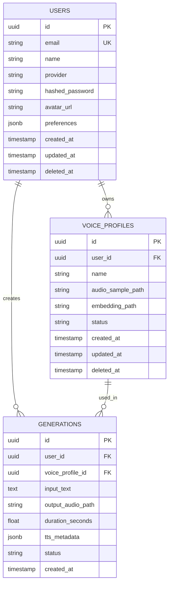

# 🗄️ CloneVoice — Database Design & Architecture

> **Role**: Senior Principal Architect & Database Engineer
> **Database Engine**: PostgreSQL 15+
> **ORM**: SQLAlchemy 2.0 + Alembic (Migrations)
> **Design Goal**: Robust, secure, production-grade, and highly scalable relational schema for a generative AI voice application.

---

## 🏗️ Architectural Principles & Standards

1. **UUIDs for Primary Keys**: All tables use `UUID` (v4) instead of auto-incrementing integers. This prevents ID enumeration attacks, avoids sequence locking in high-concurrency environments, and simplifies data merging/sharding in the future.
2. **Soft Deletes**: Critical user data and voice profiles are never `DELETE`d. A `deleted_at` timestamp is used to retain referential integrity and audit history.
3. **Audit Timestamps**: Every table includes `created_at` and `updated_at` (auto-managed).
4. **JSONB Future-Proofing**: Extensible `metadata` columns using Postgres `JSONB` allow adding feature-specific flags (e.g., advanced TTS tuning parameters, UI preferences) without schema migrations.
5. **Foreign Key Indexing**: All foreign keys have dedicated B-Tree indexes to prevent full-table scans during relational joins or cascading deletions.

---

## 📊 Entity Relationship Diagram (ERD)

---

## 📝 Table Definitions

### 1. `users` Table
Stores authentication identity and core profile data. Designed to handle both local (email/password) and OAuth (Google) authentication transparently.

| Column | Type | Constraints | Description |
|--------|------|-------------|-------------|
| `id` | `UUID` | `PK`, `DEFAULT gen_random_uuid()` | Unique identifier. |
| `email` | `VARCHAR(255)` | `UNIQUE`, `NOT NULL` | User's email address. Indexed for auth lookups. |
| `name` | `VARCHAR(255)` | `NOT NULL` | Display name of the user. |
| `provider` | `VARCHAR(50)` | `NOT NULL`, `DEFAULT 'local'` | Identifies auth source (`local`, `google`, `github`). |
| `hashed_password`| `TEXT` | `NULL` | Bcrypt hash. Nullable because OAuth users do not have a password. |
| `avatar_url` | `TEXT` | `NULL` | Link to profile picture (e.g., from Google OAuth). |
| `preferences` | `JSONB` | `DEFAULT '{}'` | Extensible UI/UX preferences (e.g., dark mode, default voice). |
| `created_at` | `TIMESTAMPTZ`| `NOT NULL`, `DEFAULT NOW()` | Record creation timestamp. |
| `updated_at` | `TIMESTAMPTZ`| `NOT NULL`, `DEFAULT NOW()` | Auto-updated on record modification. |
| `deleted_at` | `TIMESTAMPTZ`| `NULL` | Soft delete marker. |

**Indexes**:
- `CREATE UNIQUE INDEX idx_users_email ON users(email) WHERE deleted_at IS NULL;`

---

### 2. `voice_profiles` Table
Stores the metadata and filesystem references for the AI voice embeddings extracted via the SV2TTS encoder.

| Column | Type | Constraints | Description |
|--------|------|-------------|-------------|
| `id` | `UUID` | `PK`, `DEFAULT gen_random_uuid()` | Unique identifier. |
| `user_id` | `UUID` | `NOT NULL`, `FK -> users(id)` | Owner of the voice profile. `ON DELETE CASCADE`. |
| `name` | `VARCHAR(255)` | `NOT NULL` | User-defined label (e.g., "My Podcast Voice"). |
| `audio_sample_path`| `TEXT` | `NOT NULL` | Relative path to the raw `.wav` upload in the filesystem/S3. |
| `embedding_path` | `TEXT` | `NOT NULL` | Relative path to the pre-computed `.npy` 256-dim tensor. |
| `status` | `VARCHAR(50)` | `NOT NULL`, `DEFAULT 'ready'` | Lifecycle state: `processing`, `ready`, `failed`. |
| `created_at` | `TIMESTAMPTZ`| `NOT NULL`, `DEFAULT NOW()` | Record creation timestamp. |
| `updated_at` | `TIMESTAMPTZ`| `NOT NULL`, `DEFAULT NOW()` | Auto-updated on modification. |
| `deleted_at` | `TIMESTAMPTZ`| `NULL` | Soft delete marker. Protects generation history. |

**Indexes**:
- `CREATE INDEX idx_voice_profiles_user_id ON voice_profiles(user_id) WHERE deleted_at IS NULL;`

---

### 3. `generations` Table
An immutable audit trail and history log of every synthesized audio clip. 

| Column | Type | Constraints | Description |
|--------|------|-------------|-------------|
| `id` | `UUID` | `PK`, `DEFAULT gen_random_uuid()` | Unique identifier. |
| `user_id` | `UUID` | `NOT NULL`, `FK -> users(id)` | The user who requested the generation. |
| `voice_profile_id`| `UUID` | `NOT NULL`, `FK -> voice_profiles(id)` | The voice embedding used. |
| `input_text` | `TEXT` | `NOT NULL` | The exact prompt synthesized. |
| `output_audio_path`| `TEXT` | `NULL` | Path to generated `.wav` file (NULL if generation failed). |
| `duration_seconds`| `FLOAT` | `NULL` | Length of the generated audio (useful for rate-limiting/billing). |
| `tts_metadata` | `JSONB` | `DEFAULT '{}'` | Stores TTS parameters used (e.g., speed, variance, model version). |
| `status` | `VARCHAR(50)` | `NOT NULL`, `DEFAULT 'completed'` | State: `pending`, `completed`, `failed`. |
| `created_at` | `TIMESTAMPTZ`| `NOT NULL`, `DEFAULT NOW()` | Immutable timestamp of generation. |

*Note: No `updated_at` or `deleted_at`. Generation records are immutable logs. Deleting from history hides it from the user but retains the DB row for compliance/telemetry.*

**Indexes**:
- `CREATE INDEX idx_generations_user_id ON generations(user_id);`
- `CREATE INDEX idx_generations_created_at ON generations(created_at DESC);` (Optimized for fetching recent history).

---

## 📈 Scalability & Evolution Path

To ensure the database can scale elegantly when transitioning from V1.0 to enterprise-grade operations:

1. **Storage Tiering (S3 Migration)**
   Currently, `audio_sample_path`, `embedding_path`, and `output_audio_path` store relative filesystem paths. Because these are plain text, they can be seamlessly updated to hold `s3://` or `https://` URIs when migrating off local storage to AWS S3 / Cloudflare R2, requiring zero schema changes.

2. **Asynchronous Processing (Queues)**
   The `status` columns in `voice_profiles` and `generations` are prep-work for moving heavy PyTorch inference to Celery/Redis workers. The API will insert a row with `status='pending'` and return a 202 Accepted. The worker picks it up and updates to `completed` upon success.

3. **Billing & Rate Limiting**
   The `duration_seconds` column in the `generations` table allows `SUM(duration_seconds)` aggregation queries. This natively supports transitioning to a SaaS model with monthly audio generation limits (e.g., 60 minutes/month free tier).

4. **Multi-Tenant / Organization Support**
   Adding B2B capabilities (e.g., multiple users sharing a company's voice profile library) can be achieved by injecting an `organizations` table and adding an `org_id` to `users` and `voice_profiles`, mapping RBAC (Role-Based Access Control) effortlessly over the existing relational model.

